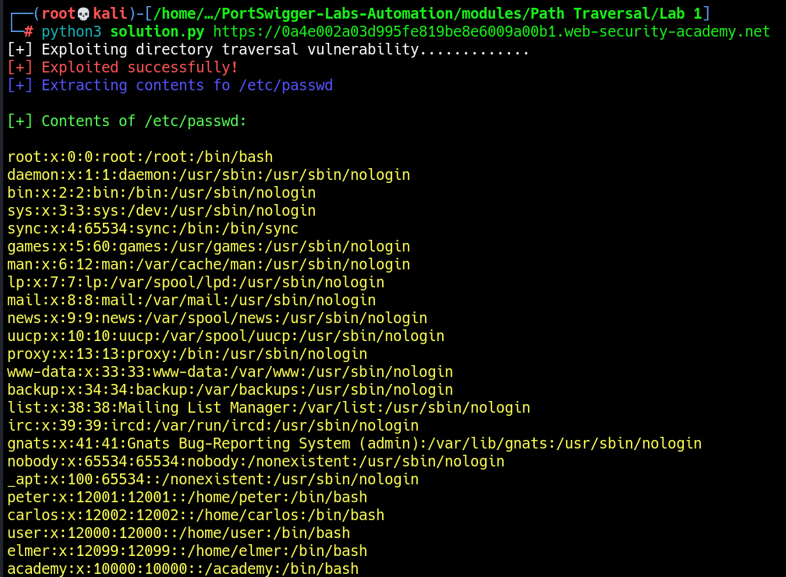

# Lab 1: File path traversal, simple case

The vulnerability exists in the `filename` parameter when retrieving images, allowing directory traversal by using `../`  sequence multiple times.\
The objective is to access the contents of `/etc/passwd`.

