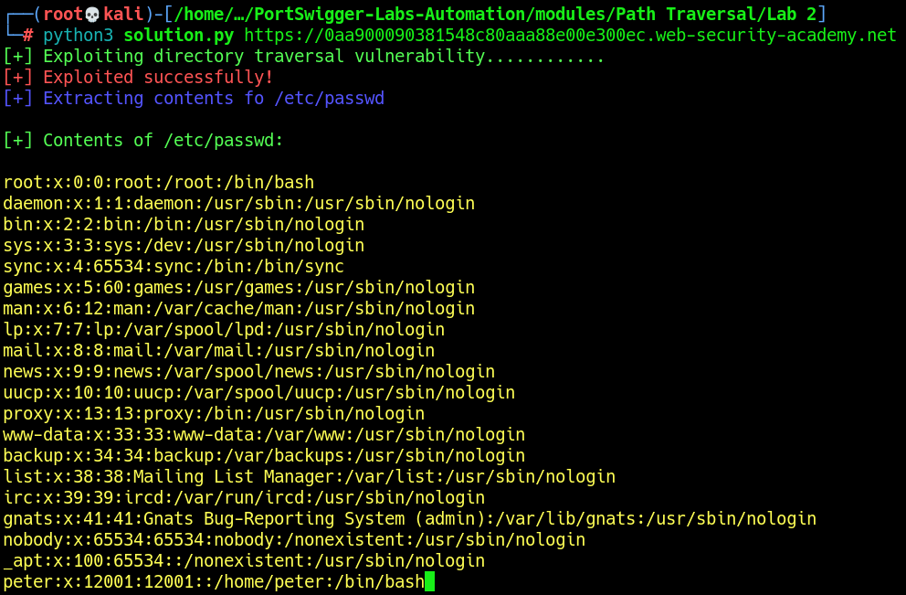

# Lab 2: File path traversal, traversal sequences blocked with absolute path bypass

The vulnerability exists in the `filename` parameter when retrieving images. However, unlike the previous lab, the `../` sequence is filtered. To bypass this restriction, files can be accessed using their absolute path.\
The objective is to retrieve the contents of `/etc/passwd.`

