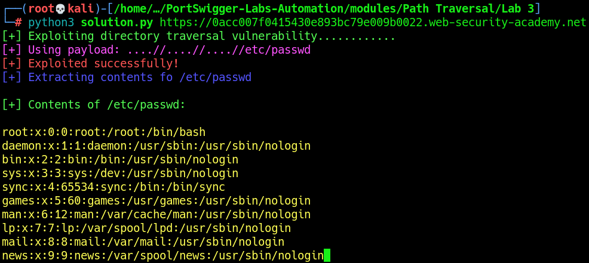

# Lab 3: File path traversal, traversal sequences stripped non-recursively

The vulnerability exists in the `filename` parameter when retrieving images. However, unlike the previous lab, the `../` sequence is filtered, but only in a `non-recursive` manner. This means we can bypass the restriction by nesting multiple `../` sequences.\
The objective is to retrieve the contents of `/etc/passwd`.

