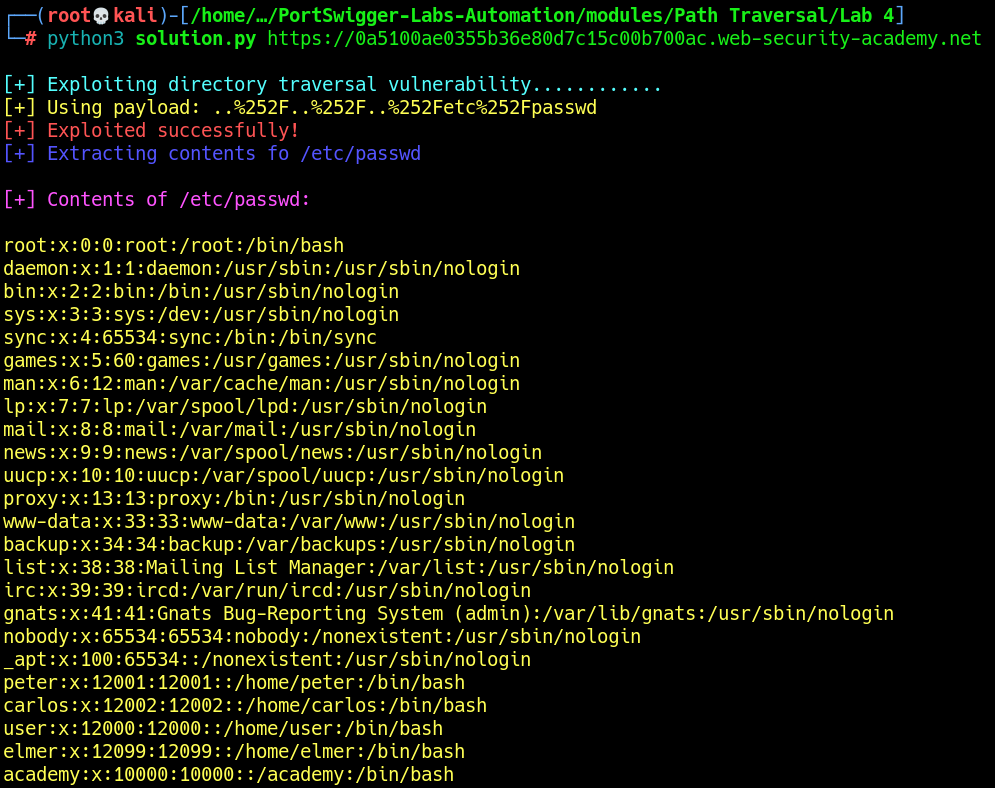

# Lab 4: File path traversal, traversal sequences stripped with superfluous URL-decode

The vulnerability exists in the `filename` parameter when retrieving images. However, the application blocks input containing the `../` sequence after URL decoding it. Therefore, we must perform URL encoding `twice`.\
The objective is to retrieve the contents of `/etc/passwd`.

