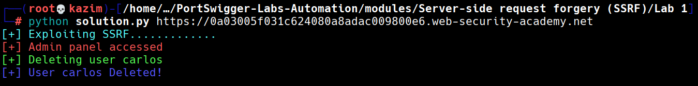

# Lab 1: Basic SSRF against the local server

This lab is vulnerable to **Server-Side Request Forgery (SSRF)** via the `stockApi` parameter in the body of a `POST` request to the `/product/stock` endpoint.
The server takes the URL passed in the `stockApi` parameter and makes a server-side HTTP request to it.

We use this SSRF to access the internal admin panel at `http://localhost/admin`. Once we confirm that the panel is accessible, we send another forged request to `http://localhost/admin/delete?username=carlos` to delete the user **carlos**, achieving the lab objective.

