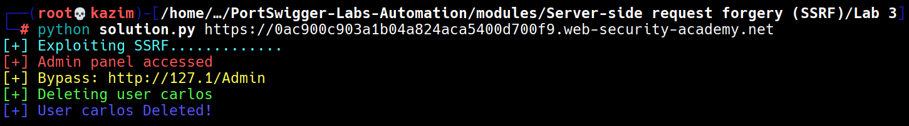

# Lab 3: SSRF with blacklist-based input filter

This lab is vulnerable to **Server-Side Request Forgery (SSRF)** via the `stockApi` parameter in the body of a `POST` request to the `/product/stock` endpoint.  
The server attempts to block access to internal systems by blacklisting certain keywords such as `localhost`, `127.0.0.1`, and `admin`.

We can bypass this filter by using an alternative **loopback IP representation** such as `127.1` (which still resolves to `127.0.0.1`) and by using case variation in the endpoint name `Admin`.  
By sending the value `http://127.1/Admin` in the `stockApi` parameter, we can access the internal admin panel despite the blacklist.

Once the admin panel is confirmed to be accessible, we send another forged request to `http://127.1/Admin/delete?username=carlos` to delete the user **carlos**, thereby completing the lab objective.

