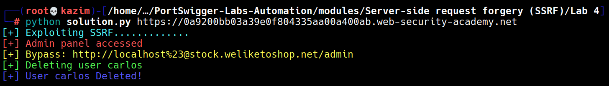

# Lab 4: SSRF with whitelist-based input filter

This lab is vulnerable to **Server-Side Request Forgery (SSRF)** via the `stockApi` parameter in the body of a `POST` request to the `/product/stock` endpoint.  
The server validates the supplied URL by extracting the hostname and ensuring it contains `stock.weliketoshop.net`.

We can bypass this restriction by exploiting the URL parser’s support for embedded credentials. By placing our target before the `@` and using a double-URL-encoded fragment character `%2523` in the username section, we can trick the validation into accepting the URL while the actual request is sent to our internal target.

The payload `http://localhost%2523@stock.weliketoshop.net/admin/delete?username=carlos` passes the whitelist check but is interpreted as a request to `http://localhost/admin/delete?username=carlos`.  
This allows us to access the admin panel and delete the user **carlos**, thereby completing the lab objective.

