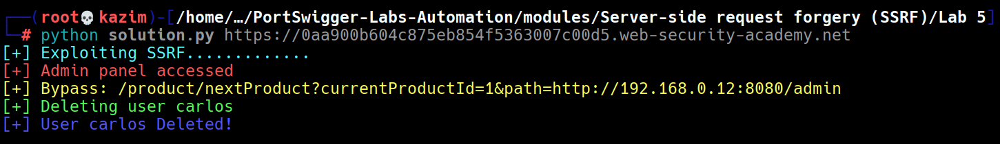

# Lab 4: SSRF with filter bypass via open redirection vulnerability

This lab is vulnerable to **Server-Side Request Forgery (SSRF)** via the `stockApi` parameter in the body of a `POST` request to the `/product/stock` endpoint.  
The application validates the supplied URL, preventing direct access to internal systems. However, it contains an **open redirection vulnerability** in the `/product/nextProduct` endpoint, which can be used to bypass the filter.

We exploit this by passing an internal URL as the `path` parameter to `/product/nextProduct`, which then redirects the server to our intended target.  
Using the payload `/product/nextProduct?currentProductId=1&path=http://192.168.0.12:8080/admin`, we can access the internal admin panel.

Once the admin panel is confirmed to be accessible, we send another forged request to `/product/nextProduct?currentProductId=1&path=http://192.168.0.12:8080/admin/delete?username=carlos` to delete the user **carlos**, thereby completing the lab objective.

