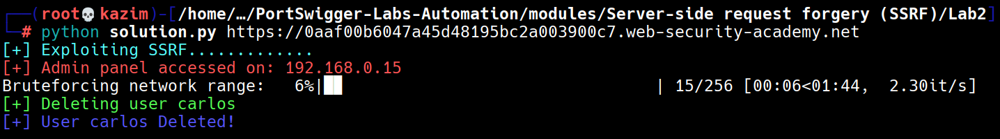

# Lab 2: Basic SSRF against another back-end system

This lab is vulnerable to **Server-Side Request Forgery (SSRF)** via the `stockApi` parameter in a `POST` to `/product/stock`.  
Unlike Lab 1 (which targeted `http://localhost/admin`), this lab requires abusing SSRF to reach **another internal back-end** that lives on the internal network (example: `http://192.168.0.X:8080/admin`) and then use that back-end to perform the action that solves the lab.

